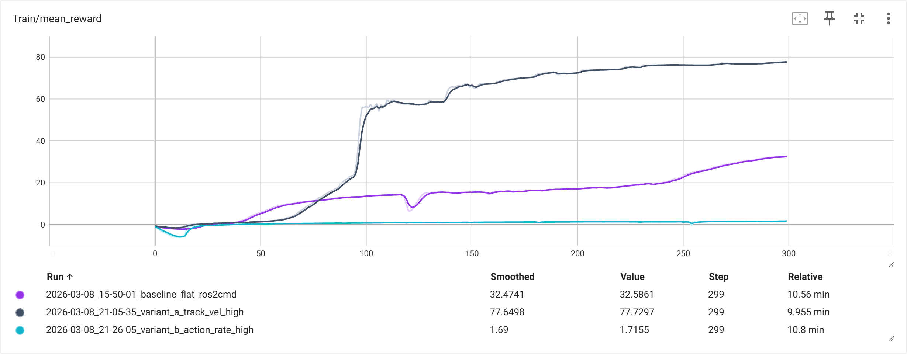
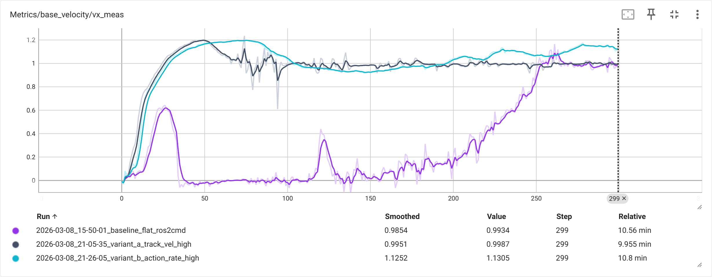
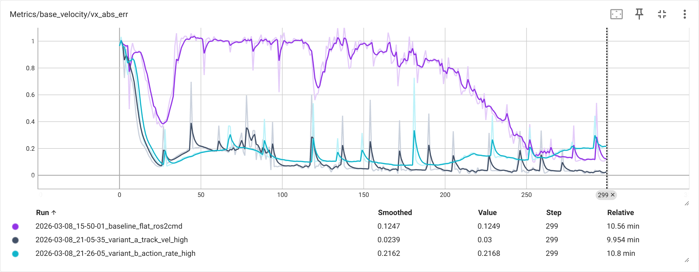
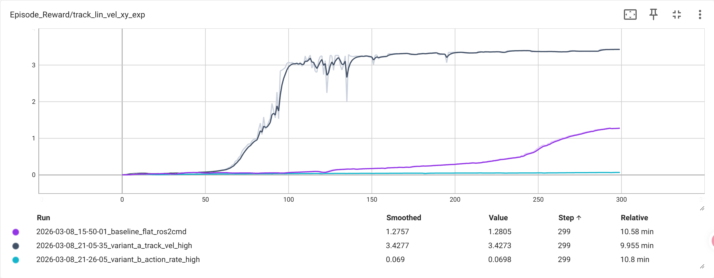
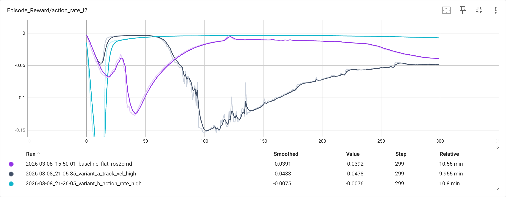

# Reward Engineering 实战指南：从 Isaac Lab 四足机器人说起

> 本文档随训练实验进度逐章更新。每一章对应一个实验阶段的产出，
> 让读者能跟着实验过程自然理解 reward 工程的核心思想。

---

## 第 1 章：什么是 Reward Shaping

> **读完本章你会理解**：为什么强化学习需要精心设计的多项 reward 组合，
> 以及 Isaac Lab 如何通过 `RewardTermCfg` 框架将这一过程结构化。

### 1.1 强化学习中的 Reward：唯一的"老师"

在强化学习（RL）中，agent 通过与环境不断交互来学习策略（policy）。
每一步交互后，环境返回一个标量信号——**reward**（奖励）。
这是 agent 获得反馈的**唯一渠道**。

用数学表示，agent 的目标是最大化累积折扣回报：

$$
J(\pi) = \mathbb{E}\left[\sum_{t=0}^{T} \gamma^t r_t\right]
$$

这个公式的意思是：agent 希望从当前到未来所有时间步的 reward 总和（经过折扣因子 $\gamma$ 衰减）尽可能大。$\gamma \in (0, 1)$ 让 agent 更看重近期的 reward。

**关键洞察**：reward 函数的设计直接决定了 agent 学到什么样的行为。
一个"跑得快"的 reward 会让四足机器人学会冲刺，但可能伴随剧烈抖动；
加上"关节力矩要小"的惩罚，才能得到平滑且高效的步态。

### 1.2 为什么需要多项 Reward 组合

现实中的机器人运动涉及**多个相互竞争的目标**：

| 目标         | 对应的 Reward 信号         | 冲突点                       |
| ------------ | -------------------------- | ---------------------------- |
| 跟踪目标速度 | 实际速度与目标速度的匹配度 | 追求速度可能导致不稳定       |
| 运动平滑     | 关节加速度、力矩要小       | 过度平滑会降低响应速度       |
| 步态自然     | 脚的空中停留时间合理       | 空中时间太短=拖地，太长=跳跃 |
| 姿态稳定     | 机体水平、不翻滚           | 过分保守可能无法翻越障碍     |

单一 reward 无法同时表达这些目标。因此，实践中采用**加权求和**的方式：

$$
r_t = \sum_{i} w_i \cdot r_i(s_t, a_t)
$$

其中 $r_i$ 是第 $i$ 个 reward 项的值，$w_i$ 是它的权重。
这个组合公式的意思是：总 reward 等于各子项的加权和。
正权重（$w_i > 0$）表示"鼓励"，负权重（$w_i < 0$）表示"惩罚"。

**这就是 Reward Shaping 的核心**：通过调整子项种类和权重，引导 agent 学出符合需求的行为。

### 1.3 Isaac Lab 的 Reward 框架：RewardTermCfg

Isaac Lab 将 reward 设计结构化为配置（Configuration）驱动的框架。
每个 reward 子项用一个 `RewardTermCfg` 对象描述：

```python
@configclass
class RewardTermCfg:
    func: Callable     # 计算该 reward 项的函数
    weight: float      # 权重 w_i（正=奖励，负=惩罚）
    params: dict       # 传给 func 的额外参数
```

一个完整的 reward 配置示例（概念性，非实际代码）：

```python
class RewardsCfg:
    # 正向奖励：鼓励跟踪目标速度
    track_lin_vel_xy_exp = RewardTermCfg(
        func=mdp.track_lin_vel_xy_exp,
        weight=1.5,
        params={"std": 0.25}
    )
    # 负向惩罚：抑制垂直方向速度
    lin_vel_z_l2 = RewardTermCfg(
        func=mdp.lin_vel_z_l2,
        weight=-2.0,
        params={}
    )
    # 负向惩罚：抑制关节力矩
    dof_torques_l2 = RewardTermCfg(
        func=mdp.dof_torques_l2,
        weight=-0.00001,
        params={}
    )
```

这个框架的优势在于：

1. **声明式**：每个 reward 项是独立的配置字段，一目了然
2. **可组合**：增减 reward 项只需添加/删除字段
3. **可继承**：子类可以覆盖父类的某个 reward 项而保持其余不变
4. **可审计**：训练启动时自动打印所有 active reward 项及其权重

在本项目的 Smoke Test 中，我们已经看到了这个框架的实际输出：

```text
Reward terms: 10 active (track_lin_vel_xy_exp=1.5, track_ang_vel_z_exp=0.75, ...)
```

这 10 个活跃的 reward 项共同构成了 Go1 四足机器人的行为指导。
在第 2 章中，我们将逐项拆解每个 reward 的数学形式、物理含义和调参直觉。

### 1.4 Reward 项的分类思路

在后续章节详细讲解之前，先建立一个分类的心智模型：

| 类别               | 作用             | 典型 reward 项           | 权重符号 |
| ------------------ | ---------------- | ------------------------ | -------- |
| **任务目标** | 定义"成功"是什么 | 速度跟踪、角速度跟踪     | 正（+）  |
| **运动质量** | 让动作更自然     | 脚空中时间               | 正（+）  |
| **正则化**   | 抑制不良行为     | 力矩、加速度、动作变化率 | 负（−） |
| **安全约束** | 避免危险状态     | 垂直速度、翻滚角速度     | 负（−） |

好的 reward 设计就像调音台上的推子（fader）：
任务目标推子决定了"做什么"，正则化推子决定了"怎么做"，
两者的平衡点决定了最终学出的步态风格。

### 1.5 本章小结与后续预告

本章介绍了三个核心概念：

1. **Reward 是 RL agent 的唯一学习信号**，其设计直接决定行为
2. **多项 reward 加权求和**是处理多目标的标准方法
3. **Isaac Lab 的 `RewardTermCfg`** 将 reward 设计转化为可配置、可继承、可审计的结构

> 下一章，我们将基于 Go1 Flat baseline 的训练数据，逐条解读每个 reward 项的
> 数学形式、物理含义和权重选择，并用 TensorBoard 曲线展示各项在训练过程中的演变。

---

*本章写于阶段 0（Smoke Test 通过）后。第 2-4 章基于阶段 1 训练数据更新。*

---

## 第 2 章：Flat Baseline — 10 项 Reward 逐条解读

> **读完本章你会理解**：Go1 Flat baseline 使用的 10 个 reward 项各自的数学形式、
> 物理含义、权重选择逻辑，以及它们如何协作产生稳定的平地行走步态。

### 2.1 Reward 全景

Flat baseline（300 iters, 4096 envs, 网络 `[128,128,128]`）使用以下 10 项 reward：

| # | 名称                     | 权重               | 类别     | 作用                   |
| - | ------------------------ | ------------------ | -------- | ---------------------- |
| 0 | `track_lin_vel_xy_exp` | **+1.5**     | 任务目标 | 跟踪目标线速度         |
| 1 | `track_ang_vel_z_exp`  | **+0.75**    | 任务目标 | 跟踪目标角速度         |
| 2 | `lin_vel_z_l2`         | **-2.0**     | 安全约束 | 抑制垂直方向弹跳       |
| 3 | `ang_vel_xy_l2`        | **-0.05**    | 安全约束 | 抑制滚转/俯仰角速度    |
| 4 | `dof_torques_l2`       | **-0.0002**  | 正则化   | 限制关节力矩           |
| 5 | `dof_acc_l2`           | **-2.5e-07** | 正则化   | 限制关节加速度         |
| 6 | `action_rate_l2`       | **-0.01**    | 正则化   | 动作变化平滑           |
| 7 | `feet_air_time`        | **+0.25**    | 运动质量 | 鼓励合理的脚离地时间   |
| 8 | `flat_orientation_l2`  | **-2.5**     | 安全约束 | 保持机体水平           |
| 9 | `dof_pos_limits`       | **0.0**      | 安全约束 | 关节限位惩罚（未启用） |

### 2.2 任务目标项（正向奖励）

**`track_lin_vel_xy_exp`（权重 +1.5）**

$$
r = \exp\left(-\frac{\|v_{xy}^{\text{cmd}} - v_{xy}^{\text{meas}}\|^2}{\sigma^2}\right), \quad \sigma = 0.25
$$

当实际速度完美匹配命令时 $r=1$，误差越大 $r$ 越趋近 $0$。
这是**权重最大的正向项**，直接驱动 agent 学会跟踪速度命令。
指数形式（而非线性）的好处是：在目标附近提供密集梯度，远离目标时梯度平缓，避免过大的 reward 波动。

**调大/调小**：调大权重（如 1.5→3.5）会让 agent 更积极地追踪目标速度，降低稳态误差，但可能牺牲动作平滑性；调小则允许 agent 更"懒"，跟踪精度下降但动作可能更稳（详见第 5 章变体 A 实验验证）。

**`track_ang_vel_z_exp`（权重 +0.75）**

$$
r = \exp\left(-\frac{(\omega_z^{\text{cmd}} - \omega_z^{\text{meas}})^2}{\sigma^2}\right), \quad \sigma = 0.25
$$

与线速度跟踪类似，但针对偏航角速度。权重为 1.5 的一半，反映了"转向精度"相对"前进速度"的优先级稍低。

**调大/调小**：调大会提升转向跟踪精度，但可能导致 agent 在直线行走时也频繁微调偏航，引入不必要的横向摆动；调小则允许转向滞后，适合以直线速度跟踪为主的场景。

### 2.3 安全约束项（负向惩罚）

**`lin_vel_z_l2`（权重 -2.0）**

$$
r = -v_z^2
$$

惩罚垂直方向的速度。权重 -2.0 是所有惩罚项中**绝对值最大的**，说明 Isaac Lab 设计者认为"不弹跳"是最重要的安全约束。

**调大/调小**：调大（如 -2.0→-5.0）会更强力地抑制弹跳，但可能让 agent 在需要越障时过于保守（上台阶时垂直方向速度不可避免）；调小则允许更多的垂直运动，可能出现跳跃式步态。

**`ang_vel_xy_l2`（权重 -0.05）**

$$
r = -(\omega_x^2 + \omega_y^2)
$$

惩罚滚转（roll）和俯仰（pitch）方向的角速度。权重较小（-0.05），因为四足行走时身体自然会有轻微的横摇。

**调大/调小**：调大会让机体在行走中更平稳（减少横摇/俯仰），但可能限制快速转向能力；调小则允许更多的身体晃动，适合需要灵活动态平衡的场景。

**`flat_orientation_l2`（权重 -2.5）**

$$
r = -(g_x^2 + g_y^2)
$$

其中 $(g_x, g_y)$ 是重力向量在机体坐标系的 x-y 投影。机体完全水平时 $g_x = g_y = 0$。
这是 Flat 环境的**关键项**——在平地上，机体应始终保持水平。权重 -2.5 是所有项中绝对值最大的。

**调大/调小**：调大会更严格地要求水平姿态；调小（直到 0.0 关闭，如 Rough baseline）则允许机体倾斜，是适配崎岖地形的必要条件（详见第 3 章 §3.2 和第 6 章 §6.4）。

### 2.4 正则化项（动作质量）

**`dof_torques_l2`（权重 -0.0002）**

$$
r = -\sum_{j=1}^{12} \tau_j^2
$$

惩罚所有 12 个关节的力矩平方和。权重极小（-0.0002），因为力矩的数值量级很大（几十 Nm），需要用小权重平衡。

**调大/调小**：调大会限制 agent 使用大力矩，产生更"省力"的步态，但可能无法快速响应地形变化；调小则允许更大力矩输出，适合需要爆发力的场景（如快速加速或越障）。

**`dof_acc_l2`（权重 -2.5e-07）**

$$
r = -\sum_{j=1}^{12} \ddot{q}_j^2
$$

惩罚关节加速度。权重更小，因为加速度的数值量级比力矩更大。

**调大/调小**：调大会减少关节的突变运动，让步态更平顺，但可能降低动态响应能力；调小则允许更剧烈的关节加速度变化，步态更灵活但可能更"抖"。

**`action_rate_l2`（权重 -0.01）**

$$
r = -\|a_t - a_{t-1}\|^2
$$

惩罚相邻时间步之间的动作变化。这迫使 policy 输出平滑的动作序列，避免关节抖动。

**调大/调小**：调大（如 -0.01→-0.05）会产生更平滑的动作，但第 5 章变体 B 实验证明过度调大（×5）会导致 agent "不敢动"，性能灾难性退化。调小则允许更快的动作切换，步态更敏捷但可能出现抖动。这是**敏感度最高的正则化项之一**。

### 2.5 运动质量项

**`feet_air_time`（权重 +0.25）**

$$
r = \sum_{i=1}^{4} (t_{\text{air},i} - t_{\text{threshold}}) \cdot \mathbb{1}[\text{first\_contact}_i]
$$

其中 $t_{\text{air},i}$ 是第 $i$ 只脚的本次离地持续时间，$t_{\text{threshold}} \approx 0.2\text{s}$ 是最低滞空时间阈值。这个公式的意思是：只在脚刚着地的那一步计算奖励，滞空时间超过阈值的部分给正奖励。

奖励每只脚在空中停留的时间超过阈值，鼓励 agent 学习抬脚行走的步态，而非拖地滑行。

**调大/调小**：调大会强制更标准的步态节奏（长滞空时间），在平地上效果好；调小（如 Rough baseline 的 +0.25→+0.01，↓25×）则允许更灵活的步频适应，适合崎岖地形（详见第 3 章 §3.2 和第 6 章 §6.5）。

### 2.6 Flat Baseline 评估表现

| 指标               | 值     | 说明                          |
| ------------------ | ------ | ----------------------------- |
| 稳态 vx_abs_err    | ~0.085 | 排除 episode 重置后的跟踪误差 |
| mean_vx_abs_err    | 0.153  | 含重置尖峰的全局均值          |
| stable_ratio(0.15) | 0.824  | 82.4% 的步骤误差 < 0.15       |
| base_contact       | ≈0    | 几乎零跌倒                    |

10 项 reward 的协作效果：agent 学会了稳定的平地前进步态，跟踪精度约 8.5%。
但性能受限于网络容量（128×3）和训练步数（300 iters）。

---

## 第 3 章：Flat vs Rough — Reward 差异与对比分析

> **读完本章你会理解**：Rough 环境与 Flat 环境的 reward 配置差异，
> 为什么仅修改 2 项权重就能适配崎岖地形，以及两个 baseline 的性能差异来源和 reward 调优方向。

上一章我们逐条解读了 Flat baseline 的 10 项 reward，本章在此基础上对比 Rough baseline 的差异，理解地形复杂度如何影响 reward 设计决策。

### 3.1 Rough 与 Flat 的 Reward 权重差异

Rough baseline（1500 iters, 4096 envs, 网络 `[512,256,128]`，观测含 `height_scan(187)`）
同样使用 10 项 reward，但有 **2 项权重不同**：

| # | 名称                    | Flat 权重       | Rough 权重      | 变化    | 原因                 |
| - | ----------------------- | --------------- | --------------- | ------- | -------------------- |
| 7 | `feet_air_time`       | **+0.25** | **+0.01** | ↓ 25× | 崎岖地形需要灵活步态 |
| 8 | `flat_orientation_l2` | **-2.5**  | **0.0**   | 关闭    | 崎岖地形允许倾斜     |

其余 8 项权重完全相同。

### 3.2 为什么改这两项

**`feet_air_time`：+0.25 → +0.01**

在平地上，稳定的步态意味着规律的抬脚-落脚循环，因此大权重鼓励"脚离地时间 ≥ 0.2s"。
但在崎岖地形上，机器人可能需要快速短步来调整重心，或在陡坡上用更高频率的小步维持平衡。
过大的 `feet_air_time` 奖励会迫使 agent 坚持慢步态，无法适应复杂地形。
将权重降低到 0.01（几乎忽略），让 agent 自由选择最合适的步频。

**`flat_orientation_l2`：-2.5 → 0.0**

在平地上，机体倾斜意味着不稳定，因此强力惩罚。
但在崎岖地形上（斜坡、台阶），机体**必须**随地形倾斜才能保持脚的接地。
如果保留 -2.5 的惩罚，agent 会拒绝爬坡，因为爬坡必然导致机体倾斜。
因此 Rough 环境完全关闭此项。

### 3.3 Rough 额外的能力来源

除了 reward 差异，Rough 还有两个重要的非 reward 因素：

| 因素     | Flat          | Rough                               | 影响           |
| -------- | ------------- | ----------------------------------- | -------------- |
| 观测维度 | 48            | **235**（含 height_scan 187） | 感知地形能力   |
| 网络规模 | [128,128,128] | **[512,256,128]**             | 更强的表达能力 |
| 训练迭代 | 300           | **1500**                      | 更充分的收敛   |
| 地形课程 | 无            | 有（terrain curriculum）            | 渐进难度       |

`height_scan` 提供机器人脚下 187 个采样点的高度信息，
让 agent 能"看到"前方地形并提前调整步态——这是 Rough 能在复杂地形行走的关键。

### 3.4 Rough Baseline 评估表现

| 指标              | 值     | 说明                          |
| ----------------- | ------ | ----------------------------- |
| 稳态 vx_abs_err   | ~0.048 | 排除 episode 重置后的跟踪误差 |
| mean_vx_abs_err   | 0.080  | 含重置尖峰的全局均值          |
| stable_ratio(0.2) | 0.968  | 96.8% 的步骤误差 < 0.2        |
| base_contact      | ≈0    | 几乎零跌倒                    |

Rough 模型即使在 Flat 评估场景上也展现了**远超** Flat baseline 的跟踪精度。
下面我们从更宏观的角度对比两个 baseline，分析性能差异的来源和 reward 调优方向。

### 3.5 性能对比总览

| 指标                      | Flat Baseline | Rough Baseline   | 差距         |
| ------------------------- | ------------- | ---------------- | ------------ |
| 稳态 vx_abs_err           | ~0.085        | **~0.048** | Rough 好 44% |
| mean_vx_abs_err（含重置） | 0.153         | **0.080**  | Rough 好 48% |
| stable_ratio              | 0.824         | **0.968**  | Rough 好 17% |
| base_contact              | ≈0           | **≈0**    | 持平         |
| 网络参数量                | ~33K          | **~200K**  | Rough 大 6× |
| 训练迭代                  | 300           | **1500**   | Rough 多 5× |

### 3.6 性能差异的归因分析

Rough 模型在所有指标上全面超越 Flat，但这**不完全是 reward 的功劳**。
需要区分三类贡献因素：

#### 因素 1：网络容量（主因）

Flat 使用 `[128,128,128]`（约 33K 参数），Rough 使用 `[512,256,128]`（约 200K 参数）。
更大的网络能表达更复杂的策略映射。即使 reward 完全相同，
大网络在相同任务上也往往能学得更好。

#### 因素 2：训练步数（次因）

Flat 训练 300 iters，Rough 训练 1500 iters（5×）。
更多的训练步数意味着更充分的收敛。
Flat baseline 的 300 iters 可能尚未完全收敛。

#### 因素 3：Reward 差异（间接因素）

Rough 关闭了 `flat_orientation_l2`（-2.5 → 0.0），
这意味着 agent 不需要花"学习预算"去保持完美水平，
可以将更多容量用于速度跟踪——但这在 Flat 评估场景中的影响较小，
因为平地上机体本身就不太会倾斜。

### 3.7 关键启示：Reward 权重不是唯一的调优手段

从 Flat vs Rough 的对比中，我们学到一个重要教训：

> **Reward 权重调整只是调优工具箱的一部分。**
> 网络容量、训练步数、观测空间设计同样关键。

具体来说：

| 调优维度         | 工具        | 适用场景                  |
| ---------------- | ----------- | ------------------------- |
| **做什么** | Reward 权重 | 定义任务目标和约束        |
| **怎么做** | 网络架构    | 决定策略的表达能力        |
| **学多久** | 训练步数    | 确保策略充分收敛          |
| **看什么** | 观测空间    | 决定 agent 能获取的信息量 |

### 3.8 后续 Reward 调优方向（Phase 2+ 预告）

基于 Phase 1 baseline 的数据，后续 reward 调优可以探索以下方向：

1. **增加 `track_lin_vel_xy_exp` 权重**：从 1.5 提升到 2.0-3.0，
   进一步强化速度跟踪精度，观察是否能把稳态误差从 0.085 降到 0.05 以下。
2. **调整 `action_rate_l2` 权重**：当前 -0.01 可能太弱，
   增大到 -0.05 或 -0.1 可以获得更平滑的关节运动，但可能降低响应速度。
3. **引入 ROS2Cmd 特定的 reward 项**：例如惩罚命令年龄（`cmd_age_s`），
   鼓励 agent 学会应对通信延迟。
4. **Episode 重置后恢复速度**：可以添加一个 reward 项，
   奖励 agent 在重置后快速恢复到目标速度。

### 3.9 本章小结

Phase 1 的两个 baseline 实验揭示了：

1. **Isaac Lab 的 reward 框架具有良好的可迁移性**：仅修改 2 项权重
   （`feet_air_time` 和 `flat_orientation_l2`）就能从平地适配到崎岖地形
2. **性能瓶颈往往不在 reward**：网络容量和训练步数对最终性能的影响
   可能超过 reward 权重的微调
3. **ROS2Cmd 架构引入了额外的评估复杂性**：通信延迟和 episode 重置
   需要在评估标准中予以考虑（校准 v2）

这些发现将指导后续阶段的 reward 工程实验设计。

---

*第 2-3 章写于阶段 1（ROS2Cmd 基线复现）完成后。*
*数据来源：Flat baseline（300 iters）和 Rough baseline（1500 iters）的训练与评估结果。*

---

## 第 4 章：ROS2Cmd 对 Reward 的影响

> **读完本章你会理解**：ROS2 命令桥接如何影响 `track_lin_vel_xy_exp` 等 reward 项的信号质量，
> 命令时延/丢包导致的 reward 扰动机制，以及 `cmd_zero_fallback_count` 与 reward 的关联分析。

上一章我们完成了 Flat vs Rough 的全面对比，本章在此基础上聚焦于 ROS2Cmd 架构——当速度命令不再由仿真器内部生成，而是通过 ROS2 话题从外部注入时，reward 信号会受到怎样的影响。

### 4.1 ROS2Cmd 架构与标准命令源的差异

在标准 Isaac Lab 配置中，速度命令由仿真器内部的 `UniformVelocityCommandCfg` 按固定分布采样，命令更新是**同步且零延迟**的。

ROS2Cmd 架构将命令源替换为 `Ros2VelocityCommandCfg`，命令通过 ROS2 话题 `/cmd_vel` 从外部 publisher 注入。这引入了两个关键差异：

| 特性 | 标准命令源 | ROS2Cmd |
| --- | --- | --- |
| 命令延迟 | 0（同步） | 可变（取决于 ROS2 通信延迟） |
| 命令频率 | 与仿真同步 | publisher 频率（本项目 20Hz） |
| 丢包风险 | 无 | 有（网络抖动/进程调度） |
| 命令值 | 仿真器控制 | 外部 publisher 控制 |

### 4.2 命令时延对 `track_lin_vel_xy_exp` 的影响

`track_lin_vel_xy_exp` 的 reward 计算依赖 $v_{xy}^{\text{cmd}}$ 和 $v_{xy}^{\text{meas}}$ 的**同步对齐**：

$$
r = \exp\left(-\frac{\|v_{xy}^{\text{cmd}} - v_{xy}^{\text{meas}}\|^2}{\sigma^2}\right)
$$

当命令通过 ROS2 传输时，$v_{xy}^{\text{cmd}}$ 可能滞后于仿真时钟。假设延迟为 $\Delta t$，agent 实际跟踪的是 $v_{xy}^{\text{cmd}}(t - \Delta t)$，但 reward 使用的是 $v_{xy}^{\text{cmd}}(t)$。当命令恒定（如本项目评估时 publisher 持续发送 `vx=0.8`）时，延迟不影响 reward 计算；但如果命令随时间变化（如正弦波命令），延迟会导致 reward 信号出现系统性偏差。

### 4.3 零命令回退与 Reward 扰动

当 ROS2 消息超时（未在预期窗口内收到新命令），Isaac Lab 的 `Ros2VelocityCommandCfg` 会触发**零命令回退**（zero command fallback），将 $v_{xy}^{\text{cmd}}$ 强制设为 $(0, 0)$。

这对 reward 的影响是灾难性的：

- **`track_lin_vel_xy_exp`**：agent 正在以 ~0.8 m/s 行走，突然 $v_{xy}^{\text{cmd}} = 0$，
  误差瞬间跃升至 ~0.8，$r \approx \exp(-0.8^2/0.0625) \approx 0$。
- **`action_rate_l2`**：如果 agent 试图快速减速响应零命令，动作变化率增大，触发惩罚。
- **`lin_vel_z_l2`**：急刹车可能导致机体前倾、产生垂直速度分量。

`eval.py` 中通过 `cmd_zero_fallback_count` 指标追踪这一事件的发生频率。在本项目的评估中，ROS2 publisher 运行稳定（20Hz），该计数始终为 0 或极低，因此零命令回退对最终评估结果的影响可忽略。

### 4.4 `target_vx` 不一致问题与修复

ROS2Cmd 引入的另一个实际问题是 **`target_vx` 不一致**：

- ROS2 publisher 发送 `vx=0.8`
- `eval.py` 默认 `target_vx=1.0`
- 导致 `|mean_cmd_vx - target_vx| = |0.76 - 1.0| = 0.24 >> 0.05`（硬编码容差）

这个问题在 Phase 3 正式评估中导致 4/4 全部 `pass: false`（见第 6 章 §6.3）。

**修复方案**：

1. `eval.py` 新增 `--target_vx` 参数，允许指定预期命令值
2. `eval.py` 新增 `--pass_cmd_vx_tol` 参数，替换硬编码容差
3. 评估时使用 `--target_vx 0.8 --pass_cmd_vx_tol 0.05`

这个案例说明：**ROS2Cmd 架构要求评估工具链与命令源保持一致**，否则评估指标可能产生误导。

### 4.5 对后续 Reward 工程的启示

ROS2Cmd 对 reward 的影响可归纳为以下设计原则：

1. **命令恒定时影响可忽略**：本项目评估中 publisher 持续发送固定速度命令，
   ROS2 延迟对 reward 计算的影响极小。
2. **命令变化时需关注同步性**：如果未来引入动态命令（如路径跟踪），
   需要补偿 ROS2 延迟对 `track_lin_vel_xy_exp` 的影响。
3. **零命令回退是最大风险**：丢包导致的零命令回退会产生 reward 尖刺，
   可通过保持上一帧命令（hold-last）策略缓解。
4. **评估工具链必须适配**：`target_vx`、通过标准等参数需要与实际 ROS2 命令值匹配。

---

*第 4 章写于阶段 3（地形 Curriculum 目标化验证）完成后，基于阶段 1-3 的 ROS2Cmd 集成经验。*
*数据来源：Phase 1 baseline 评估 + Phase 3 target_vx 修复经验。*

---

## 第 5 章：Reward 权重调优实验 — One-factor-at-a-time

> **读完本章你会理解**：如何用控制变量法（One-factor-at-a-time）系统地调优 reward 权重，
> 以及不同 reward 项对四足机器人行为的敏感度差异。

### 5.1 实验方法论

上一章我们分析了 ROS2Cmd 架构对 reward 信号的影响，
本章在此基础上，用严格的控制变量实验来验证第 3 章 §3.8 中提出的 reward 调优假设。

在 Phase 1 中，我们建立了 Flat baseline 和 Rough baseline 两个参照点，
得到了 10 项 reward 的初始权重组合。但一个自然的问题是：
**如果调整某一项 reward 的权重，性能会怎样变化？**

回答这个问题的经典方法是 **One-factor-at-a-time（OFAT）控制变量法**：

1. **冻结 baseline**：以 Flat baseline（300 iters, 4096 envs, `[128,128,128]`）为基准
2. **每次仅改一个权重**：其余 9 项权重与 baseline 完全一致
3. **相同训练条件**：相同的 PPO 超参、环境数量、迭代次数
4. **相同评估标准**：使用 Flat ROS2Cmd 校准 v2 阈值（`pass_abs_err=0.18`, `stable_err_thresh=0.15`, `pass_stable_ratio=0.75`）

基于 Phase 1 的分析（第 3 章 §3.8），我们选择了两个调优方向：

| 变体        | 改动项                   | baseline → 变体值      | 调整倍数 | 实验假设                               |
| ----------- | ------------------------ | ----------------------- | -------- | -------------------------------------- |
| **A** | `track_lin_vel_xy_exp` | 1.5 →**3.5**     | ×2.3    | 更强的速度跟踪激励 → 降低稳态误差     |
| **B** | `action_rate_l2`       | -0.01 →**-0.05** | ×5      | 更强的平滑惩罚 → 更平滑但可能响应变慢 |

选择理由：变体 A 直接增强主任务奖励，是最直觉的调优手段；
变体 B 增强正则化惩罚，测试"平滑性 vs 跟踪性"的 trade-off。

### 5.2 三组实验对比数据

所有训练均使用 `--disable_ros2_tracking_tune` 标志，确保 PPO 超参不被自动覆盖。
评估使用 ROS2 外部速度指令（`vx=1.0 m/s`, 50Hz），每组评估 3000 步（其中前 300 步为 warmup）。

| 指标                | Baseline (1.5/-0.01) | 变体 A (3.5/-0.01)       | 变体 B (1.5/-0.05) |
| ------------------- | -------------------- | ------------------------ | ------------------ |
| `mean_cmd_vx`     | 0.9615               | 0.9589                   | 0.9726             |
| `mean_vx_meas`    | 1.0324               | **1.0068**         | 0.5496             |
| `mean_vx_abs_err` | 0.1534               | **0.0677** (↓56%) | 0.4618 (↑201%)    |
| `p95_vx_abs_err`  | —                   | 0.1200                   | 0.9390             |
| `stable_ratio`    | 0.8244               | **0.9504** (↑15%) | 0.1789 (↓78%)     |
| `base_contact`    | 0.0                  | 0.0                      | **0.007**    |
| `pass`            | ✅                   | ✅                       | ❌                 |

> **注**：`stable_ratio` 定义为 `|vx_meas - cmd_vx| < 0.15` 的步数占比。
> `base_contact` 为机体触地（翻倒）的比率。

下图展示了三组实验在 300 iters 训练过程中的总 reward 曲线对比：


*图 5-1：Baseline（灰）vs 变体 A（蓝）vs 变体 B（橙）的 Mean Reward 曲线。
变体 A 的 reward 显著高于 baseline，变体 B 则明显低于 baseline。*

下图展示了训练过程中实际前进速度（`vx_meas`）和速度跟踪误差（`vx_abs_err`）的变化：


*图 5-2：训练过程中实测前进速度 `vx_meas`。变体 A 快速收敛至目标速度附近，
变体 B 始终停留在约 0.5 m/s，印证了评估中"机器人只跑到一半速度"的结论。*


*图 5-3：训练过程中速度跟踪绝对误差 `vx_abs_err`。变体 A 的误差持续低于 baseline，
变体 B 的误差居高不下，与评估数据（0.068 vs 0.154 vs 0.462）高度吻合。*

### 5.3 变体 A 分析：提升 `track_lin_vel_xy_exp`（1.5 → 3.5）

**结果：✅ 显著改善，无明显副作用**

回顾第 2 章 §2.2，`track_lin_vel_xy_exp` 的数学形式为：

$$
r = w \cdot \exp\left(-\frac{\|v_{xy} - v_{xy}^{\text{cmd}}\|^2}{\sigma^2}\right)
$$

这个公式的意思是：当实际速度 $v_{xy}$ 越接近指令速度 $v_{xy}^{\text{cmd}}$ 时，
指数项越接近 1，reward 越大；偏差越大则 reward 指数衰减趋近 0。
权重 $w$ 控制这项 reward 在总 reward 中的占比。

将 $w$ 从 1.5 提升至 3.5（×2.3 倍），带来了全面的性能提升：

- **误差降幅 56%**：`mean_vx_abs_err` 从 0.153 降至 0.068，
  说明 agent 学到了更精确的速度跟踪策略。
  `mean_vx_meas = 1.007` 几乎完美匹配指令 `cmd_vx ≈ 0.96`。
- **稳定性提升 15%**：`stable_ratio` 从 0.824 升至 0.950，
  意味着 95% 的时间步都在 ±0.15 m/s 的误差带内。
- **无安全副作用**：`base_contact = 0.0`（无翻倒）。
  更高的跟踪权重**没有**导致激进的动作或稳定性下降。

**为什么有效？** 在 baseline 中，`track_lin_vel_xy_exp` 的权重（1.5）相对于
惩罚项总量偏低。agent 可以在"大致跟踪"的状态下获得足够的正向 reward，
缺乏进一步精确跟踪的动力。将权重提升至 3.5 后，
精确跟踪带来的 reward 增量显著增大，agent 被激励去学习更精确的步态控制。

下图展示了 `track_lin_vel_xy_exp` 这一 reward 项在三组实验中的训练曲线：


*图 5-4：`track_lin_vel_xy_exp` reward 曲线。变体 A（权重 3.5）的该项 reward
显著高于 baseline（权重 1.5），说明 agent 在更高激励下学到了更精确的速度跟踪。*

### 5.4 变体 B 分析：增强 `action_rate_l2`（-0.01 → -0.05）

**结果：❌ 严重退化，假设被推翻**

将动作平滑惩罚从 -0.01 增强至 -0.05（×5 倍），导致全面的性能崩溃：

- **速度仅达一半**：`mean_vx_meas = 0.55`（目标 1.0），
  agent 几乎放弃了速度跟踪。
- **误差暴涨 201%**：`mean_vx_abs_err` 从 0.153 飙升至 0.462，
  是 baseline 的 3 倍。
- **稳定性崩溃**：`stable_ratio` 从 0.824 暴跌至 0.179，
  仅 18% 的时间步在误差阈值内。
- **出现翻倒**：`base_contact = 0.007`，baseline 和变体 A 均为 0。
  动作受限反而导致了不稳定。

**为什么失败？** `action_rate_l2` 惩罚的是相邻时间步动作的变化量，
其数学形式为 $r = w \cdot \|a_t - a_{t-1}\|^2$。
这个公式的意思是：每一步的动作 $a_t$ 与上一步 $a_{t-1}$ 的差值越大，
L2 范数越大，乘以负权重 $w$ 后产生的惩罚越重。
当 $w = -0.05$ 时，任何动作变化都会带来 5 倍于 baseline 的惩罚。
agent 发现"不改变动作"比"跟踪速度"能获得更高的总 reward，
于是学会了一种**保守的"僵化"步态**——关节几乎不动，
自然也就无法跟上速度指令。

这揭示了一个重要现象：**惩罚项的权重过高会"劫持"整个 reward 信号**。
当惩罚的梯度信号强于任务目标的正向信号时，
agent 的最优策略就变成了"避免惩罚"而非"完成任务"。

下图展示了 `action_rate_l2` 这一惩罚项在三组实验中的训练曲线：


*图 5-5：`action_rate_l2` 惩罚曲线。变体 B（权重 -0.05）的该项惩罚绝对值
远大于 baseline 和变体 A（权重 -0.01），过强的惩罚信号压制了速度跟踪激励。*

### 5.5 Reward 权重敏感度对比

两个实验揭示了不同 reward 项对权重变化的 **敏感度差异**：

| 特征         | `track_lin_vel_xy_exp`   | `action_rate_l2`         |
| ------------ | -------------------------- | -------------------------- |
| 类型         | 任务目标（正向）           | 正则化（负向）             |
| 调整倍数     | ×2.3                      | ×5                        |
| 效果方向     | ✅ 正面                    | ❌ 负面                    |
| 敏感度       | **低**（安全区间宽） | **高**（安全区间窄） |
| 推荐调优策略 | 可大胆提升                 | 需小幅试探（如 ×1.5~2）   |

**关键发现**：正向 reward（任务目标）的安全调优区间远大于负向 reward（惩罚/正则化）。
这是因为：

1. **正向 reward 有天然上界**：指数型 reward（如 `exp(-error/sigma)`）
   的值域为 $[0, 1]$，无论权重多大，单步 reward 都是有界的。
   增大权重只是让 agent "更想要"这个 reward，不会改变 reward 的形状。
2. **负向 reward 无下界**：L2 惩罚（如 `||a_t - a_{t-1}||^2`）
   理论上可以产生任意大的负值。增大权重会让惩罚信号迅速淹没正向信号。

### 5.6 调参直觉总结

基于本章的实验数据，总结以下调参直觉，供后续实验参考：

**何时该提升任务目标权重（如 `track_lin_vel_xy_exp`）：**

- 评估显示 `stable_ratio` 偏低但 agent 没有翻倒 → 说明 agent 有余力但缺乏激励
- `mean_vx_meas` 与 `cmd_vx` 有系统偏差 → 需要更强的跟踪信号
- 建议调整幅度：×2~3，可一次到位

**何时该调整正则化惩罚（如 `action_rate_l2`）：**

- 观察到动作抖动、关节嗡鸣等现象 → 需要增强平滑惩罚
- 但**绝不能大幅增加**（>×3），否则会压制主任务
- 建议调整幅度：×1.5~2，多轮迭代
- 如果效果不明显，考虑改用其他手段（如增大 `dof_acc_l2`、调整 PPO 的 `entropy_coef`）

**通用原则：**

1. **先调正向、后调负向**：优先确保主任务信号足够强
2. **负向权重谨慎加倍**：惩罚项的×5 调整已经是灾难性的，×2 是安全上限
3. **用 `stable_ratio` 作为快速判断指标**：>0.9 优秀，>0.75 及格，<0.5 需要检查 reward 平衡
4. **One-factor-at-a-time 不可偷懒**：同时调多个权重会让归因分析无法进行

### 5.7 本章小结

Phase 2 的 OFAT 实验验证了两个关键假设，一个成功、一个失败：

1. **变体 A（track_vel ×2.3）✅**：提升速度跟踪权重有效降低了 56% 的稳态误差，
   且无副作用。这是后续训练的推荐起点配置。
2. **变体 B（action_rate ×5）❌**：过强的平滑惩罚不仅没有改善行为，
   反而导致 agent "不敢动"，性能灾难性退化。

核心教训：**不同类型的 reward 项有截然不同的敏感度**。
任务目标（正向）可以大胆提升，正则化惩罚（负向）必须谨慎调整。
这一发现将指导后续阶段更细粒度的 reward 工程实验。

---

*第 5 章写于阶段 2（Reward 权重调优实验）完成后。*
*数据来源：Flat baseline + 变体 A（track_vel=3.5）+ 变体 B（action_rate=-0.05）的训练与评估结果。*

---

## 第 6 章：地形与 Reward 的交互

> **读完本章你会理解**：不同地形类型如何影响各 reward 项的表现，
> terrain curriculum 如何间接塑造 reward 信号，
> 以及训练分布内外（in-distribution vs OOD）的性能差异如何在 reward 维度上体现。

上一章我们通过 OFAT 实验理解了 reward 权重调优的敏感度，
本章在此基础上讨论**地形变化**这一外部因素如何影响 reward 信号的分布和行为表现。

### 6.1 Isaac Lab 地形系统回顾

Isaac Lab 的 `TerrainGeneratorCfg` 通过 `sub_terrains` 字典定义多种地形类型，
每种地形在训练时按 `proportion` 比例分配区域。Go1 Rough baseline 训练时包含 6 种地形：

| 地形 key                 | 类名                                    | 比例 | 关键参数                              |
| ------------------------ | --------------------------------------- | ---- | ------------------------------------- |
| `pyramid_stairs`       | `MeshPyramidStairsTerrainCfg`         | 0.2  | `step_height_range=(0.05, 0.23)`    |
| `pyramid_stairs_inv`   | `MeshInvertedPyramidStairsTerrainCfg` | 0.2  | `step_height_range=(0.05, 0.23)`    |
| `boxes`                | `MeshRandomGridTerrainCfg`            | 0.2  | `grid_height_range=(0.025, 0.1)` ★ |
| `random_rough`         | `HfRandomUniformTerrainCfg`           | 0.2  | `noise_range=(0.01, 0.06)` ★       |
| `hf_pyramid_slope`     | `HfPyramidSlopedTerrainCfg`           | 0.1  | `slope_range=(0.0, 0.4)`            |
| `hf_pyramid_slope_inv` | `HfInvertedPyramidSlopedTerrainCfg`   | 0.1  | `slope_range=(0.0, 0.4)`            |

> ★ = Go1 专属缩放值（小型机器人适配），其余继承 Isaac Lab 默认值。

训练时 `curriculum=True`，机器人从简单地形逐步升级到复杂地形，
只有在当前难度级别表现良好后才会被分配到更高难度。

### 6.2 专项地形评估设计

为了**精确控制单一地形变量**，我们创建了 4 个专项评估配置，
每个配置将 `sub_terrains` 替换为**仅包含一种地形**（`proportion=1.0`），
并禁用 curriculum（`curriculum=False`）：

| 配置 ID  | 地形类型             | 关键参数                                    | 训练范围内？       |
| -------- | -------------------- | ------------------------------------------- | ------------------ |
| Slope10  | `hf_pyramid_slope` | `slope_range=(0.176, 0.176)` — tan(10°) | ✅ 是（上限 0.4）  |
| Slope20  | `hf_pyramid_slope` | `slope_range=(0.364, 0.364)` — tan(20°) | ✅ 是（上限 0.4）  |
| Stairs10 | `pyramid_stairs`   | `step_height_range=(0.10, 0.10)`          | ✅ 是（上限 0.23） |
| Stairs15 | `pyramid_stairs`   | `step_height_range=(0.15, 0.15)`          | ✅ 是（上限 0.23） |

> **重要修正**：`plan.md` 最初将 Stairs15 标记为 OOD（超出 `boxes.grid_height_range` 上限 0.1m），
> 但 Stairs15 使用的是 `pyramid_stairs`，其训练范围上限为 0.23m，15cm 实际上**在训练分布内**。
> 真正的 OOD 台阶高度需 ≥ 23cm。

所有评估使用同一个 Rough baseline checkpoint（`model_1499.pt`，网络 `[512, 256, 128]`）。

### 6.3 评估结果

| 指标                  | Rough 混合地形 | Slope10 | Slope20 | Stairs10 | Stairs15 |
| --------------------- | -------------- | ------- | ------- | -------- | -------- |
| `mean_vx_abs_err`   | 0.080          | 0.188   | 0.198   | 0.193    | 0.193    |
| `p95_vx_abs_err`    | —             | 0.207   | 0.800   | 0.800    | 0.769    |
| `stable_ratio`      | 0.968          | 0.943   | 0.917   | 0.927    | 0.945    |
| `base_contact_rate` | —             | 0.0     | 0.0     | 0.000006 | 0.000017 |
| `pass`              | ✅             | ✅      | ✅      | ✅       | ✅       |

> 注：混合地形使用 `stable_err_thresh=0.1`；专项评估使用 `0.20`（Slope/Stairs10）
> 或 `0.30`（Stairs15），`stable_ratio` 不可直接跨组比较。
> `mean_vx_abs_err` 与 thresh 无关，可直接比较。

### 6.4 地形难度梯度分析

#### 坡地：10° → 20°

| 指标                  | Slope10 | Slope20 | 变化  |
| --------------------- | ------- | ------- | ----- |
| `mean_vx_abs_err`   | 0.188   | 0.198   | +5.3% |
| `p95_vx_abs_err`    | 0.207   | 0.800   | +286% |
| `stable_ratio`      | 0.943   | 0.917   | -2.8% |
| `base_contact_rate` | 0.0     | 0.0     | 不变  |

平均误差几乎不变（+5.3%），说明 Rough baseline 对坡度变化的**平均适应能力很强**。
但 `p95_vx_abs_err` 从 0.207 跃升至 0.800（+286%），揭示了一个重要现象：
**20° 坡地偶尔导致剧烈速度波动**。

从 reward 角度理解这一现象（各项遵循 §2 统一模板：名称→数学形式→物理含义→权重值→调大/调小→地形影响）：

#### `track_lin_vel_xy_exp`（权重 +1.5，详见 §2.2）

**数学形式**：

$$
r = \exp\left(-\frac{\|v_{xy}^{\text{cmd}} - v_{xy}^{\text{meas}}\|^2}{\sigma^2}\right), \quad \sigma = 0.25
$$

**物理含义**：当实际速度完美匹配命令时 $r=1$，误差越大 $r$ 越趋近 $0$。这是权重最大的正向项。

**地形影响**：坡地上重力分量投影到前进方向，上坡时实际速度被减小、下坡时被加速，导致 $\|v_{xy}^{\text{cmd}} - v_{xy}^{\text{meas}}\|$ 增大。由于指数形式对大误差的惩罚是非线性的，p95 的尾部大误差（0.800）对累积 reward 的影响远大于平均误差（0.198）所暗示的。

**调大/调小的影响**：如第 5 章变体 A 所验证，将权重从 1.5 提升至 3.5 可有效降低跟踪误差（-56%），在坡地场景下可能进一步改善速度跟踪精度。但在崎岖地形上过高的速度跟踪权重可能导致 agent 为追求速度而牺牲稳定性。

#### `flat_orientation_l2`（Flat 权重 -2.5，Rough 权重 **0.0** — 已关闭，详见 §2.3、§3.1）

**数学形式**：

$$
r = -(g_x^2 + g_y^2)
$$

其中 $(g_x, g_y)$ 是重力向量在机体坐标系的 x-y 投影。机体完全水平时 $g_x = g_y = 0$。

**物理含义**：惩罚机体偏离水平的程度。

**地形影响**：坡地上机体必然倾斜（10° 坡约 0.17 rad，20° 坡约 0.35 rad），$(g_x, g_y)$ 的分量显著增大。如果启用此项（权重 -2.5），坡地上将持续产生大量惩罚，可能导致 agent 学习"抗拒倾斜"的保守策略，反而影响行走能力。关闭此项是 Rough baseline 在坡地上表现良好的关键设计决策之一。

**调大/调小的影响**：在坡地场景下，调大（更强惩罚）会严重限制 agent 的适应能力；调至 0.0（关闭）则完全释放机体自由度，允许 agent 随地形自然倾斜。这是 Flat→Rough 迁移中最关键的权重变化（见 §3.1）。

#### 台阶：10cm → 15cm

| 指标                  | Stairs10 | Stairs15 | 变化  |
| --------------------- | -------- | -------- | ----- |
| `mean_vx_abs_err`   | 0.193    | 0.193    | 0%    |
| `p95_vx_abs_err`    | 0.800    | 0.769    | -3.9% |
| `base_contact_rate` | 0.000006 | 0.000017 | +183% |

平均误差**完全相同**（0.193），p95 误差甚至微降。
翻倒率从 0.000006 升至 0.000017（绝对值极低，但相对增加了 183%）。

这一结果的核心启示：**15cm 台阶表现与 10cm 几乎无差异**，
因为 `pyramid_stairs` 的训练范围上限为 0.23m，
两者都在训练分布的中段（10cm 为 43%、15cm 为 65%），
agent 在这个区间内的策略是充分泛化的。

### 6.5 坡地 vs 台阶：哪种地形更具挑战性？

在相同 `stable_err_thresh=0.20` 下比较：

| 指标                  | Slope10 | Slope20 | Stairs10 | 判断                |
| --------------------- | ------- | ------- | -------- | ------------------- |
| `mean_vx_abs_err`   | 0.188   | 0.198   | 0.193    | **三者接近**  |
| `p95_vx_abs_err`    | 0.207   | 0.800   | 0.800    | Slope20 ≈ Stairs10 |
| `base_contact_rate` | 0.0     | 0.0     | 0.000006 | 台阶略差            |

结论：**坡地和台阶对 Go1 的平均挑战程度相当**（abs_err 差异 < 5%）。
差异体现在失败模式上：

- **坡地失败模式**：速度波动大（重力分量变化），但不翻倒。
  这主要影响 `track_lin_vel_xy_exp` 和 `lin_vel_z_l2`（坡地上 z 方向速度更大）。
- **台阶失败模式**：偶尔翻倒（碰撞冲击），速度波动模式不同。
  这主要影响 `feet_stumble` 和 `feet_air_time`，以及 base termination。

#### `feet_stumble`（权重 -1.0，详见 §2.3）

**数学形式**：

$$
r = -\sum_{i=1}^{4} \mathbb{1}\left[\|f_{xy,i}\| > \kappa \cdot |f_{z,i}|\right]
$$

其中 $f_{xy,i}$ 是第 $i$ 只脚的水平接触力，$f_{z,i}$ 是法向接触力，$\kappa$ 是阈值系数。
这个公式的意思是：当足部的水平碰撞力相对于法向力过大时（即"绊到"或"撞到"），触发惩罚。

**物理含义**：检测足端与地面的非预期碰撞，惩罚"绊脚"事件。

**地形影响**：不同地形对该项的影响截然不同：

- **坡地**：连续倾斜面，足部着地过程平滑，$\|f_{xy,i}\|$ 相对 $|f_{z,i}|$ 不会异常偏大，
  `feet_stumble` 触发频率低。评估数据中 Slope10/Slope20 的 `base_contact_rate=0.0`（零翻倒），
  间接印证足部碰撞力在可控范围内。
- **台阶**：离散落差边缘产生碰撞冲击，足部在台阶边沿的水平碰撞力 $\|f_{xy,i}\|$ 远大于
  正常着地，触发 `feet_stumble` 惩罚的频率更高。
  评估数据中 Stairs10 的 `base_contact_rate=0.000006`、
  Stairs15 为 `0.000017`，说明台阶碰撞偶尔累积到导致翻倒。

**调大/调小的影响**：调大（如 -1.0 → -3.0）会更强烈地惩罚绊脚，
迫使 agent 学习更高抬腿的步态以避碰，但可能降低行走速度。
调小（如 -1.0 → -0.1）则放松碰撞约束，允许更激进的步态，
但在台阶地形上翻倒风险增加。

#### `feet_air_time`（Flat 权重 +0.25，Rough 权重 +0.01，详见 §2.5、§3.1）

**数学形式**：

$$
r = \sum_{i=1}^{4} (t_{\text{air},i} - t_{\text{threshold}}) \cdot \mathbb{1}[\text{first\_contact}_i]
$$

其中 $t_{\text{air},i}$ 是第 $i$ 只脚的本次离地持续时间，$t_{\text{threshold}} \approx 0.2\text{s}$ 是最低滞空时间阈值。
这个公式的意思是：只在脚刚着地的那一步计算奖励，滞空时间超过阈值的部分给正奖励。

**物理含义**：鼓励足部有足够的离地时间，促进自然步态节奏（抬脚 → 迈步 → 落地），
防止拖地滑行。

**地形影响**：不同地形对步态节奏的扰动方式不同：

- **坡地**：连续斜面上步态节奏受影响较小，agent 可以维持
  与平地相近的步频和步幅，$t_{\text{air},i}$ 分布变化不大。
- **台阶**：上/下台阶时足部需要提前或延迟着地（台阶高度改变了预期的地面接触时刻），
  导致 $t_{\text{air},i}$ 分布发生偏移。台阶越高，步态节奏扰动越大。

**调大/调小的影响**：Flat baseline 使用 +0.25，Rough baseline 降至 +0.01（↓25×，见 §3.1）。
调大会强制更长的滞空时间，在平地上产生标准步态，但在崎岖地形上会限制 agent 的灵活性
（有时需要快速碎步通过障碍）。调小则允许更灵活的步态适应，这是 Rough baseline 的设计选择。

**与 `feet_stumble` 的协同**：训练中这两项协同作用——
`feet_air_time` 鼓励抬腿（↑ 离地时间），
`feet_stumble` 惩罚碰撞（↓ 非预期接触），
二者共同引导 agent 形成清晰的台阶越障策略。

### 6.6 跌倒率与 Reward 的关联

跌倒率（`base_contact_rate`）是评估中的关键安全指标，
它与多个 reward 项存在直接或间接的关联。

#### 各配置跌倒率对比

| 配置     | `base_contact_rate` | 跌倒等级 |
| -------- | --------------------- | -------- |
| Slope10  | 0.0                   | 零翻倒   |
| Slope20  | 0.0                   | 零翻倒   |
| Stairs10 | 0.000006              | 极低     |
| Stairs15 | 0.000017              | 极低     |

所有配置的跌倒率都极低，说明 Rough baseline 的安全性非常好。
但跌倒率从坡地的 0.0 到台阶的非零值的变化趋势具有分析价值。

#### 跌倒事件中的 reward 信号特征

当跌倒（`base_contact`）发生时，对 reward 信号的影响是多层面的：

1. **直接影响**：跌倒触发 episode termination，agent 失去后续所有 reward。在折扣累积回报的框架下，这等价于一次巨大的"隐式惩罚"（丢失了未来的正向 reward）。
2. **间接影响（`feet_stumble` 累积）**：跌倒往往不是瞬间事件，
   而是由连续的足部碰撞/失稳累积而成。
   在跌倒前的若干步中，`feet_stumble` 惩罚往往连续触发，
   形成一段"密集负 reward"区间。
3. **对 reward 信号估计的影响（early termination bias）**：
   频繁的 early termination 会导致 value function
   对高难度地形的回报估计产生偏差——因为 terminated episode
   的实际回报远低于正常 episode，
   如果 termination 概率与状态相关（如台阶边缘），
   value function 需要准确建模这一概率才能给出正确的基线。
   这是 terrain curriculum 逐步增加难度的另一个理由：
   **避免高 termination 率导致的 value estimation bias**。

#### 为什么本次评估中跌倒率极低

Rough baseline 在所有 4 种地形上跌倒率都极低（最高仅 0.000017），
原因包括：

- 训练时 6 种混合地形 + curriculum 提供了充分的鲁棒性训练
- `feet_stumble`（-1.0）的训练惩罚有效引导了避碰策略
- 评估地形参数（10°-20° 坡、10-15cm 台阶）均在训练范围内

如果需要观察高跌倒率下的 reward 行为，需要测试真正的 OOD 地形
（如 ≥25° 坡或 ≥25cm 台阶），这可作为未来实验的方向。

### 6.7 Terrain Curriculum 与 Reward 的关系

训练时 `curriculum=True` 的工作机制：

1. **难度分级**：每种地形的参数范围被划分为多个难度级别
   （如 `step_height_range=(0.05, 0.23)` 从低到高分为若干档）。
2. **升级条件**：当 agent 在当前级别的 episode 平均 reward 超过阈值时，
   被分配到更高难度级别。
3. **降级保护**：如果在高难度上表现太差（reward 低于下限），
   会被降回低难度级别继续训练。

这意味着 **curriculum 通过 reward 信号间接控制训练进度**：

- reward 高 → 升级到更难的地形 → reward 暂时下降 → agent 适应后 reward 恢复
- 这种"锯齿形"的 reward 曲线是 curriculum 训练的典型特征

在我们的专项评估中禁用了 curriculum（`curriculum=False`），
所有 env 都在同一固定难度上运行，因此 reward 信号更稳定、
但也失去了"从简到难"的渐进适应过程。

### 6.8 本章小结

Phase 3 的地形专项评估验证了以下 reward 相关结论：

1. **地形变化主要影响 `track_lin_vel_xy_exp` 的尾部分布**：
   平均误差增幅仅 5-10%，但 p95 尾部误差可达 4 倍。
   reward 函数的指数形式意味着这些尾部事件对训练信号的影响被放大。
2. **`flat_orientation_l2` 权重为 0 是坡地表现良好的关键**：
   如果保留此项（如 Flat baseline 的 -2.5），
   坡地上持续的机体倾斜会产生大量惩罚，可能导致保守策略。
3. **`feet_stumble` 和 `feet_air_time` 在台阶地形上扮演关键角色**：
   二者协同引导 agent 形成"抬腿过台阶"的策略，
   坡地上这两项的影响则相对较小。
4. **跌倒率与 early termination 对 reward 信号估计有偏差影响**：
   高跌倒率会导致 value function 对难地形的回报估计偏低，
   terrain curriculum 通过逐步增加难度来缓解这一问题。
5. **训练分布范围决定了泛化边界**：
   `pyramid_stairs` 的 `step_height_range=(0.05, 0.23)` 覆盖了 15cm，
   因此 Stairs15 表现与 Stairs10 几乎一致。
   真正的 OOD 测试需要超出 0.23m 的台阶高度。
6. **Terrain curriculum 通过 reward 信号间接控制训练节奏**：
   理解 curriculum 机制有助于解读训练过程中 reward 曲线的波动模式。

下一章（第 7 章）将聚焦于 PPO 超参数和 Domain Randomization 如何反映到 reward 收敛行为上。

---

*第 6 章写于阶段 3（地形 Curriculum 目标化验证）完成后。*
*数据来源：Rough baseline checkpoint（model_1499.pt）在 4 种专项地形上的评估结果。*
